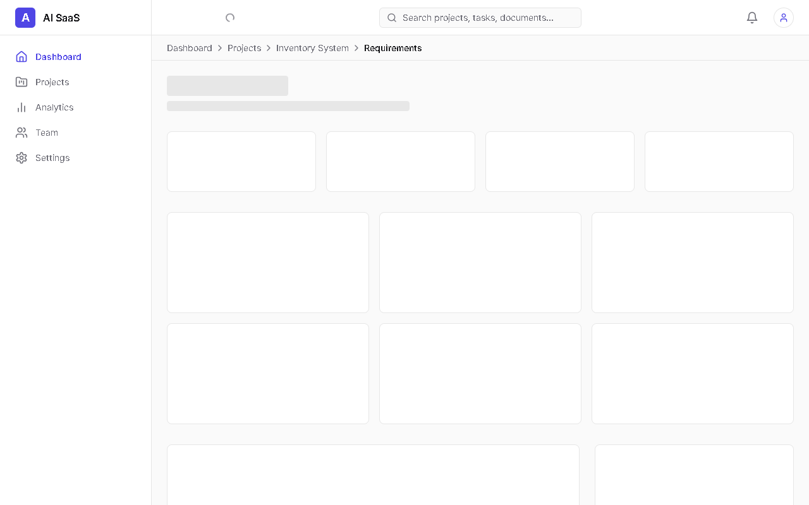
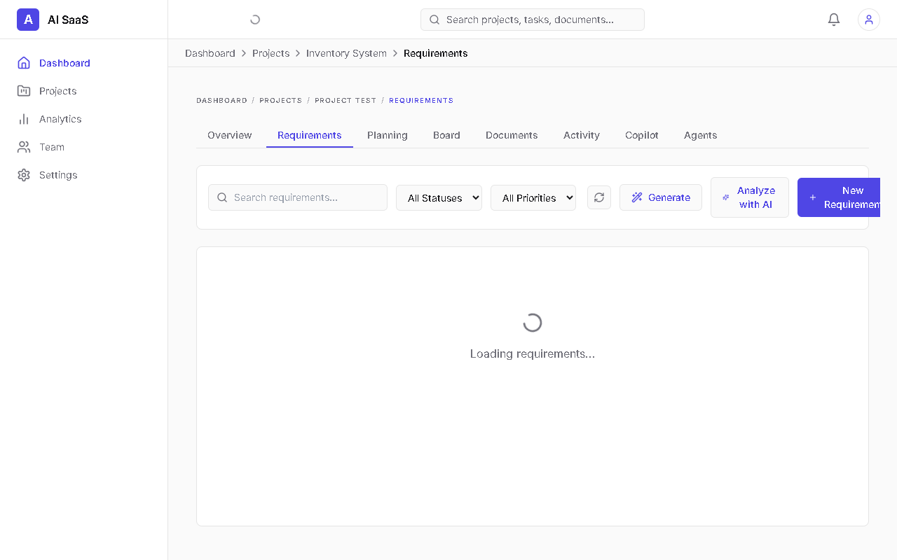
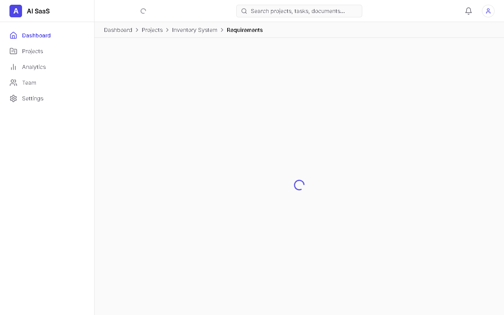
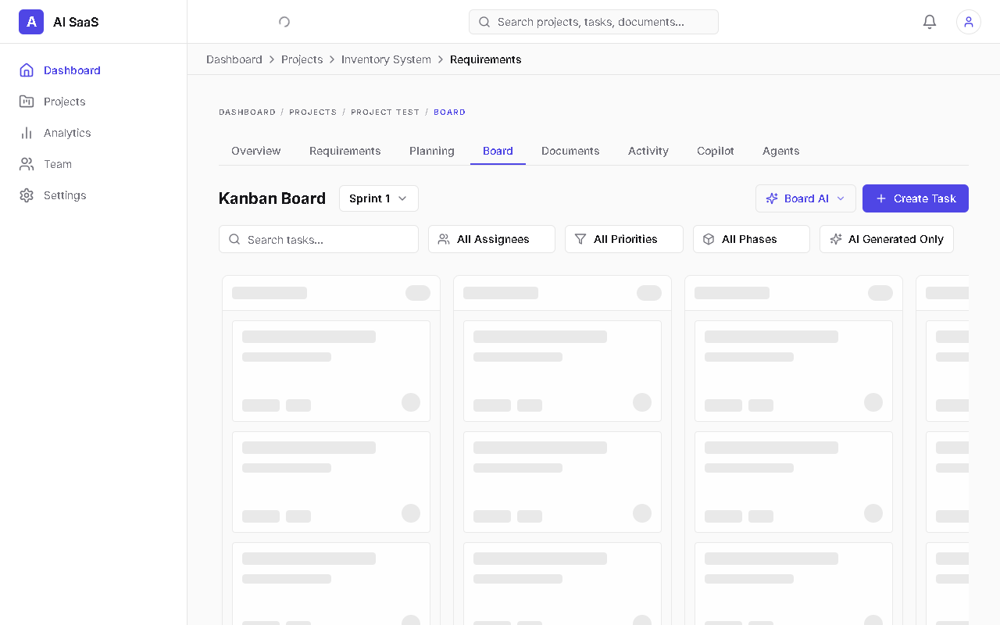

# AI-Powered Project Management SaaS

A production-ready, highly modular, AI-native Project Management Platform. This software accelerates traditional agile workflows by integrating artificial intelligence directly into the Software Development Life Cycle (SDLC). 

## 1. Project Overview and Purpose

This platform fundamentally changes how teams plan and execute software projects. Instead of manually writing tickets, project managers can upload raw context (PDFs, docs, notes) to a secure, localized Retrieval-Augmented Generation (RAG) pipeline. The system provides tools for direct CRUD requirement management, augmented by AI Analysis that provides suggestions. From approved requirements, the system generates exactly 5 project phases, generates detailed kanban tasks with full traceability, and recommends task assignments—all while enforcing strict role-based access control and tenant isolation. 

## 2. Screenshots / Product Preview

**1. Login / Dashboard**  


**2. Requirements CRUD + AI Analysis**  


**3. Requirement Version History**  


**4. 5-Phase Planning**  


**5. AI Task Generation / Task Review**  


**6. Developer Recommendation**  


**7. Kanban Board**  


## 3. Key Features

- **Requirement Management & AI Analysis**: Direct CRUD interface for requirements, with a secondary AI workflow providing suggestions (AI does not directly modify requirements). Features full version history and approved-requirement re-versioning.
- **5-Phase Planning**: Generates exactly 5 project phases directly from approved requirements.
- **AI Task Generation**: Automatically breaks down planned requirements into actionable sub-tasks, maintaining strict traceability to both the parent requirement and the planned phase.
- **Developer Recommendation**: Intelligently recommends team members for specific tasks based on workload. It does not automatically assign them; human approval is strictly required.
- **Team/Roles (RBAC)**: Comprehensive permission matrices controlling view, edit, and AI-generation capabilities across Owners, Admins, Project Managers, and Members within isolated organizations.
- **Kanban Board**: Real-time task tracking with WebSocket integration, using real task records and real assignee data.

## 4. Human-in-the-Loop AI Workflow

The platform relies on a "Human-in-the-Loop" approval concept to ensure AI accuracy and safety before executing actions:

1. **Upload**: User uploads raw project context or documentation.
2. **Requirements & AI Analysis**: Users manually create requirements via Direct CRUD, utilizing AI suggestions based on the vector store.
3. **Human Approval (Phase 1)**: The Project Manager reviews, edits, and explicitly approves the requirements, tracking the version history.
4. **Planning**: The system generates exactly 5 phases from the approved requirements.
5. **Human Approval (Phase 2)**: The team reviews the sprint plan and approves it.
6. **AI Task Generation**: The AI generates detailed, atomic Kanban tasks and recommends developer assignments.
7. **Human Approval (Phase 3)**: Final approval materializes the AI's proposed tasks directly to the active Kanban board for execution.

## 5. Technology Stack

**Frontend**
- Next.js 15 (App Router)
- React 19 + TypeScript
- Tailwind CSS & Framer Motion
- TanStack Query (React Query)
- React Hook Form + Zod

**Backend**
- Python 3.11+
- FastAPI (Async HTTP Framework)
- SQLAlchemy 2.0 (Async DB ORM)
- Alembic (Migrations)
- Celery (Background Workers)

**Database & Infrastructure**
- PostgreSQL (Primary Data Store)
- pgvector (Vector storage for AI Embeddings)
- Redis (Broker for WebSockets and Celery)
- Docker & Docker Compose (Container Orchestration)

**AI & Machine Learning**
- Groq API (High-speed LLM inference - `llama-3.3-70b-versatile`)
- SentenceTransformers (Local lightweight embeddings - `all-MiniLM-L6-v2`)

## 6. Architecture / Project Structure

The system strictly adheres to **Clean Architecture** to separate concerns:

```text
backend/
├── app/
│   ├── api/          # FastAPI routers and HTTP controllers (v1 endpoints)
│   ├── core/         # Settings, Security, Celery configs, WS Manager
│   ├── models/       # SQLAlchemy 2.0 declarative base models
│   ├── schemas/      # Pydantic v2 validation and serialization schemas
│   ├── repositories/ # Data access layer (abstracts SQLAlchemy queries)
│   ├── services/     # Core business logic (AI prompt engineering, tasks)
│   ├── tasks/        # Celery background asynchronous workers
frontend/
├── app/              # Next.js App Router (Pages & Layouts)
├── components/       # Reusable React UI components
├── lib/              # Utility functions, API clients
├── hooks/            # Custom React hooks
```

## 7. Main API / Workflow Overview

The core backend API (`/api/v1`) revolves around these primary domains:
- `/auth`, `/organizations`, `/team`: Handles JWT authentication, multi-tenant workspace routing, and RBAC enforcement.
- `/projects`, `/documents`: Manages project creation and ingests files into the vector database via async Celery tasks.
- `/requirements`: Interfaces with the CRUD logic and LLM to manage and version structured SRS data.
- `/planning`, `/sprints`: Maps requirements to the 5 chronological phases.
- `/task-generation`, `/tasks`: Handles the AI task breakdown logic, approval endpoints, and Kanban state mutation.
- `/ai_insights`, `/copilot`: Global AI assistant endpoints.
- `/collaboration`: WebSocket endpoints for real-time presence and task updates.

## 8. Database and Migration Setup

The application uses **PostgreSQL** alongside **pgvector** for traditional relational data and AI embeddings. 
Schema migrations are handled by **Alembic**.

When the backend container starts, it automatically runs migrations to ensure the database schema is up-to-date. In development, you can manually generate new migrations using:
```bash
# Generate a new migration inside the backend container
alembic revision --autogenerate -m "Add new feature table"
# Apply migrations manually
alembic upgrade head
```

## 9. Local Installation and Run Instructions

### Prerequisites
- Docker and Docker Compose
- Node.js 22 (if running frontend standalone)
- Python 3.11+

### 1. Environment Setup
Clone the repository and prepare your environment variable files. Ensure you have a valid Groq API Key.

```bash
cp .env.example .env
cp backend/.env.example backend/.env
# Add GROQ_API_KEY to your .env files
```

### 2. Launch Infrastructure via Docker
The entire infrastructure boots seamlessly via Docker Compose:

```bash
docker-compose up --build -d
```

- **Frontend App**: `http://localhost:3000`
- **Backend API & Swagger Docs**: `http://localhost:8000/docs`
- **Flower (Celery Worker Dashboard)**: `http://localhost:5555`

Wait roughly 30 seconds on the first boot for Alembic to migrate the external PostgreSQL database schema.

## 10. Testing & Validation Overview

The project incorporates multiple testing layers to ensure stability:
- **Backend (Pytest)**: Located in `backend/tests/`. Run tests locally or inside the Docker container using `pytest`. Evaluates core domain logic, AI service abstractions, and HTTP route health.
- **Frontend (Jest & React Testing Library)**: Located in `__tests__/`. Covers React component rendering and frontend unit logic.
- **E2E (Puppeteer)**: Basic integration and end-to-end user flows validated via Puppeteer scripts.

## 11. Author
Created by **[Your Name / Organization]**
